# Index Basket

A tokenised index fund on Hedera, as a [Scaffold-HBAR](https://docs.hedera.com/solutions/tools/scaffold-hbar/index) template. One HBAR deposit into `BasketVault` buys a 40% WHBAR / 30% SAUCE / 30% USDC basket on SaucerSwap V2 in a single transaction and mints an HTS share token (IBSK) for your slice. Redeeming burns shares and pays out your slice of every token in kind. The vault rebalances itself on a timer it books with the Hedera Schedule Service, so no keeper bot, server or hot key exists anywhere. Chainlink HBAR/USD prices the fund in dollars and gates every deposit and rebalance on a fresh oracle answer.

```bash
npm create scaffold-hbar@latest -- --template kamalbuilds/scaffold-hbar-index-basket
```

The `--` matters with `npm create`: without it npm keeps `--template` for itself. `npx create-scaffold-hbar@latest --template kamalbuilds/scaffold-hbar-index-basket` is equivalent.

What a reader gets from the scaffold: one Solidity contract that is the whole protocol, 110 Foundry tests that need no network, a Next.js fund page (live NAV, target against actual weights, deposit, redeem, automation runway), a script that runs every flow on testnet and prints a HashScan link per transaction, and [AGENTS.md](AGENTS.md) for coding agents.

## Why it needs SaucerSwap, Chainlink, HTS and HSS

Each integration does a job nothing else in the stack can do. Remove one and a named function stops working.

| Piece | What it does here | Without it |
| --- | --- | --- |
| SaucerSwap V2 | `deposit` swaps WHBAR into SAUCE and USDC with `exactInput`. Pool `slot0` is the spot price behind NAV, share minting and every rebalance trade. | The vault cannot buy a basket and has no on-chain price for any leg. |
| Chainlink HBAR/USD | `navUsd()` and `sharePriceUsd()` price the fund in USD. `deposit` and `rebalance` revert on a stale or non-positive answer. The optional guard compares a stablecoin pool to the feed. | The fund is priced in HBAR only, and a manipulated pool is the only price a deposit sees. |
| HTS | The share token is a native HTS token created by the contract in `initialize`, with the vault as treasury and the vault's contract id as supply key, so `mintToken` and `burnToken` run inside the deposit and redeem transactions. Basket tokens are HTS tokens. | There is no share token the vault alone can mint, and no native token a wallet shows. |
| HSS (HIP-1215) | `startAutomation` has the vault call `scheduleCall` on itself. Hedera executes `runScheduled`, which books the next run. | Rebalancing needs an off-chain bot with a funded key, and the fund stops when the bot does. |

Hedera features in use:

| Feature | Where |
| --- | --- |
| HTS system contract `0x167`: `createFungibleToken`, `mintToken`, `burnToken` | `initialize`, `deposit`, `redeem` |
| HSS system contract `0x16b` (HIP-1215): `scheduleCall`, `hasScheduleCapacity`, `deleteSchedule` | `startAutomation`, `runScheduled`, `stopAutomation` |
| HIP-719 token association: `associate()` at each token's own address | `initialize` associates the vault. The UI walks users through associating IBSK before depositing and the basket tokens before redeeming |
| Mirror node REST | Association checks, the activity feed (`/contracts/{id}/results/logs`), and the live script's association and contract-result checks. `eth_getLogs` on Hashio is range-limited, so the UI never uses it |

## How the pieces connect

```mermaid
flowchart TD
    subgraph DEP["Deposit: one transaction"]
        D1["deposit with HBAR"] --> D2["Read Chainlink HBAR/USD and pool spot prices"]
        D2 --> D3["Wrap HBAR to WHBAR through WhbarHelper"]
        D3 --> D4["SaucerSwap V2 exactInput: WHBAR to SAUCE and to USDC at their weights"]
        D4 --> D5["Value added, priced at the pre-trade spot"]
        D5 --> D6["HTS mintToken, then transfer IBSK to the depositor"]
    end

    subgraph RED["Redeem in kind: reads no price"]
        R1["approve IBSK to the vault"] --> R2["redeem shares"]
        R2 --> R3["transferFrom, then HTS burnToken"]
        R3 --> R4["Pay the same fraction of WHBAR, SAUCE and USDC held"]
    end

    subgraph LOOP["Scheduled rebalance loop: no bot"]
        S1["Owner calls startAutomation"] --> S2["HSS scheduleCall: runScheduled, expiry, 4M gas"]
        S2 --> S3["Hedera calls runScheduled at expiry, paid from vault HBAR"]
        S3 --> S4["Book the successor schedule first"]
        S4 --> S5["try rebalance"]
        S5 --> S6{"A leg outside the drift band?"}
        S6 -->|yes| S7["Sell overweight legs, then buy underweight legs"]
        S6 -->|no| S8["Emit ScheduledRun, traded false"]
        S7 --> S9["Emit ScheduledRun, traded true"]
        S8 -.->|"next expiry"| S3
        S9 -.->|"next expiry"| S3
    end
```



## Quickstart

Prerequisites:

- Node.js 20.18.3 or later
- Yarn (`corepack enable`) or npm. In an npm project every `yarn x` below is `npm run x`
- [Foundry](https://book.getfoundry.sh/getting-started/installation) (`forge`, `cast`), plus `jq` and `curl` for the live script
- An ECDSA Hedera testnet account funded from the [portal faucet](https://portal.hedera.com/faucet)

Run it:

```bash
# 1. Contract tests. No network, no key.
yarn foundry:test

# 2. Put the funded account's key in packages/foundry/.env (install copies `.env.example` to it)
#    add a line:  DEPLOYER_PRIVATE_KEY=0x...

# 3. Deploy a vault to testnet and run every flow once, with a HashScan link per transaction
yarn foundry:live

# 4. Start the app at http://localhost:3000
yarn next:dev
```

Step 3 deploys `BasketVault`, calls `initialize` with 30 HBAR (the HTS token creation fee comes out of it and the rest stays in the vault as fuel), associates your account with IBSK, deposits 10 HBAR, rebalances, adds 10 HBAR of fuel, starts automation at a 120 second interval, waits for the network to run the schedule, then associates WHBAR, SAUCE and USDC, approves half your shares and redeems them. It regenerates `packages/nextjs/contracts/deployedContracts.ts`, so step 4 shows the vault you just deployed.

Reuse a deployed vault instead of deploying: `VAULT=0x... yarn foundry:live`.

The app signs with a burner wallet (`enableBurnerWallet` in `packages/nextjs/scaffold.config.ts`; fund its address from the faucet) or any wallet set to Hedera Testnet, chain id 296.

## Environment variables

Nothing is required to run `yarn foundry:test` or `yarn next:dev`. `DEPLOYER_PRIVATE_KEY` is required to deploy.

| Variable | Where | Purpose | Default |
| --- | --- | --- | --- |
| `DEPLOYER_PRIVATE_KEY` | `packages/foundry/.env` | ECDSA key of the funded testnet account that deploys and runs `yarn foundry:live`. Never commit it | none |
| `HEDERA_RPC_URL` | `packages/foundry/.env` | JSON-RPC endpoint for `yarn foundry:live` and `yarn foundry:test:testnet` | `https://testnet.hashio.io/api` |
| `DRIFT_BPS` | shell, at deploy time | How far a leg may sit from its weight before a rebalance trades, in basis points of NAV. Read by `Deploy.s.sol`. `DRIFT_BPS=50 yarn foundry:live` | `500` |
| `DEPOSIT_HBAR`, `INTERVAL`, `VAULT` | shell, for `yarn foundry:live` | Deposit size in HBAR, automation interval in seconds, an existing vault to reuse | `10`, `120`, deploy a new one |
| `NEXT_PUBLIC_HEDERA_TESTNET_RPC_URL` | `packages/nextjs/.env.local` | App JSON-RPC endpoint for testnet | `https://testnet.hashio.io/api` |
| `NEXT_PUBLIC_HEDERA_MAINNET_RPC_URL` | `packages/nextjs/.env.local` | App JSON-RPC endpoint for mainnet | `https://mainnet.hashio.io/api` |
| `NEXT_PUBLIC_HEDERA_TESTNET_MIRROR_URL` | `packages/nextjs/.env.local` | Mirror node the fund page reads associations and activity from | `https://testnet.mirrornode.hedera.com` |
| `NEXT_PUBLIC_WALLET_CONNECT_PROJECT_ID` | `packages/nextjs/.env.local` | Your WalletConnect project id | a shared scaffold id |
| `HEDERA_MIRROR_TESTNET_URL`, `HEDERA_MIRROR_MAINNET_URL` | `packages/nextjs/.env.local` | Mirror nodes behind the scaffold's `/api/hedera/account` route (used by the debug tools) | the public Hedera mirror nodes |
| `NEXT_PUBLIC_IGNORE_BUILD_ERROR` | build environment | `true` lets `next build` pass with type or lint errors | off |

## How it works

### Setup: `initialize`

The owner sends HBAR with `initialize(name, symbol)`. The vault associates itself with WHBAR and every basket token (HIP-719), then calls `createFungibleToken` with itself as treasury and as supply key, 8 decimals and an infinite supply. Whatever HBAR HTS does not take as the creation fee stays in the vault as fuel for scheduled runs.

### Deposit: the depositor bears their own impact

`deposit(minShares)` reads the Chainlink answer and every pool's spot price before it trades, and computes NAV from them. It then wraps the HBAR, spends each leg's weight share of it in a SaucerSwap V2 `exactInput` swap (output floor: spot minus `slippageBps`, 3% on the deployed vault), and values what was bought at the same pre-trade spot. Shares minted are `valueAdded * supply / navBefore`. Because pricing is fixed before the swaps, fees and price impact from the depositor's own trades reduce their shares and never dilute existing holders. A depositor cannot move a pool and mint against the moved price within one transaction.

The first deposit mints `valueAdded` shares and locks `DEAD_SHARES` (1e5 base units, 0.001 IBSK) in the treasury for good. Nobody can own the entire supply, which closes the share-inflation attack where a first depositor donates tokens to the vault to round later depositors down to zero.

### Redeem: in kind, reading no price

`redeem(shares)` pulls the shares with `transferFrom` (so the holder first approves the vault on IBSK), burns them with `burnToken`, and sends `balance * shares / supply` of WHBAR, SAUCE and USDC. It never touches the oracle or a pool, so a stale Chainlink feed or a broken pool cannot trap a holder. A test proves redeem succeeds while deposit reverts on a stale feed. The recipient must be associated with the three basket tokens, and the UI lists the missing associations as steps before the button.

### Rebalance: permissionless, sell then buy

`rebalance()` can be called by anyone and can only move the basket toward its targets. With `band = NAV * driftBps / 10_000` it first sells every leg worth more than `target + band` down to its target, so the WHBAR for the buys exists, then buys every leg worth less than `target - band` with at most the WHBAR the vault holds. If no leg is outside the band it trades nothing and returns `false`. Every swap carries the same spot-derived slippage floor as a deposit.

### Automation: books the successor first, never reverts

`startAutomation(interval)` (owner, 60 seconds to 60 days) calls HSS `scheduleCall` on the vault itself. `_secondWithCapacity` asks `hasScheduleCapacity` for the ideal second and probes +1, +2, +4, +8 and +16 seconds when it is busy. At the expiry Hedera calls `runScheduled` with the vault as `msg.sender`, which is its only access check. `runScheduled` then:

1. clears the executed schedule and, if automation is on, books the next one before anything else, because Hedera allows one `scheduleCall` per scheduled execution and a lost booking ends the chain (a failed booking sets the interval to 0, so automation reads as off and can be restarted);
2. runs `rebalance()` inside `try/catch`, emitting `ScheduledRun(traded)` or `ScheduledRunFailed(reason)`, so a failing rebalance costs one run and never the loop.

The booking gas is 4,000,000 and the contract refuses anything under `MIN_SCHEDULED_GAS` of 3,000,000: a self-rescheduling call below that runs once, fails to book its successor and still reports `SUCCESS`.

Fuel is native HBAR sitting in the vault, separate from basket value. The payer must hold the full gas reservation, not just what a run burns: 4,000,000 gas times the gas price, about 3.52 HBAR. Runway in runs is `(fuel - reservation) / cost per run + 1`. The fund page computes it from the last run's measured cost. `withdrawFuel` moves native HBAR only, and `stopAutomation` deletes the pending schedule.

## Proven on Hedera testnet

The app points at this vault: a 40% WHBAR / 30% SAUCE / 30% USDC basket with a 0.5% drift band (`DRIFT_BPS=50`) and a 6 hour interval.

| What | Link |
| --- | --- |
| BasketVault | [0x1af34177Be9371490e96cE5420C71D8D95c97EaB](https://hashscan.io/testnet/contract/0x1af34177Be9371490e96cE5420C71D8D95c97EaB) |
| Share token IBSK, created by the contract | [0.0.10837828](https://hashscan.io/testnet/token/0.0.10837828) |

### Network-triggered rebalances that traded

No person sent a transaction for either run. Hedera executed the vault's own schedule, and the payer was the vault. To give the vault something to correct, an outside account first swapped 150 WHBAR into USDC on the WHBAR/USDC pool, moving the pool tick from 39629 to 39970 (USDC +3.5%) ([swap](https://hashscan.io/testnet/transaction/0x05e4db83cdb523b4b46760697cf292029ea833fa6caea288e37d5c8fb55e7509)).

| Run | Result | Transaction |
| --- | --- | --- |
| 1: USDC overweight, sell | `ScheduledRun(traded=true)`. Swapped 0.128852 USDC for 0.06991741 WHBAR. NAV 10.0893 to 10.0890 HBAR. USDC leg back to target | [1791007856.060140104](https://hashscan.io/testnet/transaction/1791007856.060140104) |
| 2: USDC underweight, buy | After a second outside swap pushed USDC back down (tick 39602) ([swap](https://hashscan.io/testnet/transaction/0x821077eaa53e28cb1c9b6eb32f263e7f39e36ffc2c495046aed48e6c58de408c)): `ScheduledRun(traded=true)`. Swapped 0.07639555 WHBAR for 0.145183 USDC. NAV 9.9799 to 9.9797. Weights back to 40.02 / 29.98 / 30.00 | [1791008035.035022208](https://hashscan.io/testnet/transaction/1791008035.035022208) |

Runs with nothing outside the band emit `ScheduledRun(traded=false)`, for example at consensus second 1791007678.

### Deposit and redeem through the app

A burner wallet (account 0.0.10838073, unlimited auto-association) drove the Next.js fund page:

- Deposit 5 HBAR: 4.99048386 IBSK minted against a page estimate of 4.9999 and a floor of 4.8499. Transaction [0x2fcdac89...](https://hashscan.io/testnet/transaction/0x2fcdac89a903e2bd9377df92aea9e9c447bd2d2a800a69e059b3f16a0c588d5a), 429,187 gas.
- Redeem 2 IBSK (approve, then redeem): 0.80076975 WHBAR, 23.985553 SAUCE and 1.143176 USDC, equal to the preview shown before signing. [HashScan](https://hashscan.io/testnet/transaction/0x156e6b815067557710804a9c1d8f824cdbbf74417857377057063c8cb7eb8feb)

### Every flow on that vault

| Step | Gas | Transaction |
| --- | --- | --- |
| initialize (creates the HTS share token) | 2,319,199 | [0x48be3fac...](https://hashscan.io/testnet/transaction/0x48be3fac85e38fd15d40c3c5ff4b8a6efe3fdb947b2d1a22f70e3b82c7f101ee) |
| associate IBSK (HIP-719) | 726,488 | [0x411622c3...](https://hashscan.io/testnet/transaction/0x411622c384cdd17646ba8e05a3d7beb5680156e77ac9255f7c929d8a4a8f29a8) |
| deposit 20 HBAR: 6 WHBAR for 239.4005 SAUCE, 6 WHBAR for 11.3798 USDC, 19.9568 IBSK minted | 1,137,106 | [0x166dbdf6...](https://hashscan.io/testnet/transaction/0x166dbdf605c53460968ffec8becd0ee5ed30eeb0e395bfb3b2b1708ed5beb102) |
| rebalance, nothing drifted (`traded=false`) | 121,408 | [0xdd9beb67...](https://hashscan.io/testnet/transaction/0xdd9beb6769ce51dde656f632de15f580259bf858d332cdd40a0a0a52df2be062) |
| fuel 10 HBAR | 21,055 | [0x1441846...](https://hashscan.io/testnet/transaction/0x1441846009e435af9371bbf9073a1e46e496574c4a5d7194600d8b4919c2bbbb) |
| startAutomation 180 s | 1,509,051 | [0x7923a785...](https://hashscan.io/testnet/transaction/0x7923a7852a6441465dbd9a16f5a7f3ae3a890d2f205b39791951615aba745f6f) |
| approve shares | 727,032 | [0xd0577d8...](https://hashscan.io/testnet/transaction/0xd0577d8130e84f3f56684eab0fde805f6c70fb3758ebab502efc4b85d1add0c8) |
| redeem 9.9784 IBSK: 3.9998 WHBAR, 119.6943 SAUCE, 5.6896 USDC | 142,321 | [0x4c33133b...](https://hashscan.io/testnet/transaction/0x4c33133b1fb8caf8d9e3f8b28a68543f1edef4551dd8bc83b9a51af1e5534328) |

An earlier deployment ran the loop at a 120 second interval with a 5% band. Six consecutive runs started by the network, about 118 seconds apart, then `stopAutomation` and `withdrawFuel`. Two of them: [1791006680.001599104](https://hashscan.io/testnet/transaction/1791006680.001599104) and [1791007035.034493895](https://hashscan.io/testnet/transaction/1791007035.034493895), each a `CONTRACTCALL` with result `SUCCESS` paid by the vault.

## Costs

Measured on testnet. Fee is gas times the network gas price at the time.

| Step | Gas | HBAR |
| --- | --- | --- |
| `initialize` (includes HTS token creation fee) | 2,319,199 | 13.7422 |
| Associate a token (HIP-719) | 726,488 | 0.6102 |
| First deposit (10 HBAR, approves the router for each token) | 1,136,144 | 0.9543 |
| Later deposits (router already approved) | 429,078 | 0.3604 |
| Approve shares to the vault | 727,032 | 0.6107 |
| Redeem | 142,321 | 0.1195 |
| `rebalance`, nothing drifted | 121,408 | 0.1019 |
| `startAutomation` | 1,509,051 | 1.2676 |
| Scheduled run, no trade | n/a | 1.305 |
| Scheduled run with a swap | n/a | 1.396 |

Scheduled runs are charged to the vault, not to a person. An HTS approval from a contract costs about 700k gas, so the vault approves the router once per token for the token's total supply and re-approves only when short. That is why the second deposit costs 429k instead of 1.14M.

Runway on the app's vault: 83.53 HBAR of fuel, 1.396 HBAR per run, 3.52 HBAR reservation, so about 58 runs, roughly 14 days at 6 hours per run.

## Customize

### Change the basket

Edit `legs` in `packages/foundry/script/Deploy.s.sol`. Each leg is a token, a SaucerSwap V2 pool that pairs it with WHBAR, and a weight in basis points:

```solidity
legs[0] = BasketVault.LegConfig({
    token: 0x0000000000000000000000000000000000120f46, // SAUCE 0.0.1183558
    pool: 0x37814eDc1ae88cf27c0C346648721FB04e7E0AE7, // WHBAR/SAUCE 0.30%
    weightBps: 3000
});
```

WHBAR takes `10_000 - sum(weights)`, so the legs must sum to less than 10,000. The constructor reverts with `BadConfig` for a pool that is not paired with WHBAR, a zero weight, or weights that leave nothing for WHBAR. Resize the `legs` array to add or drop a token. `packages/foundry/script/live-testnet.sh` hard-codes the default WHBAR, SAUCE and USDC addresses for the associations before redeeming, so edit those three lines when you change tokens.

### Drift band

`DRIFT_BPS` sets the band. The default is 500 (5% of NAV). The app's vault runs 50 (0.5%), tight enough that a 3.5% pool move produced a trade at the next scheduled run. `DRIFT_BPS=50 yarn foundry:live`.

### Price guard

The guard compares the implied HBAR/USD of a stablecoin leg's pool to Chainlink and reverts a deposit or rebalance when they differ by more than `maxDeviationBps`. It is configured in `Deploy.s.sol` through `guardLeg` (index into `legs`, or `type(uint256).max` for none) and `maxDeviationBps`.

Testnet pools are not arbitraged: the WHBAR/USDC pool implies about $1.90 per HBAR against Chainlink's $0.10. The testnet deploy therefore leaves the guard off (`guardLeg: type(uint256).max`), and the Chainlink freshness check still gates every deposit and rebalance. A mainnet deploy turns it on, where arbitrage keeps the pool and the feed together:

```solidity
guardLeg: 1,          // index of the USDC leg
maxDeviationBps: 300  // 3%
```

### Mainnet

1. Replace the router, WhbarHelper, WHBAR, token and pool addresses in `Deploy.s.sol` with the mainnet ones from the SaucerSwap docs, and `hbarUsdFeed` with the HBAR/USD proxy from the Chainlink feed directory.
2. Turn on the price guard as above.
3. Deploy through the scaffold's keystore flow: `yarn foundry:account:generate`, then `yarn foundry:deploy --network hedera_mainnet`.
4. In the app, set `CHAIN_ID` in `packages/nextjs/utils/basket/constants.ts` to the Hedera mainnet chain and point `NEXT_PUBLIC_HEDERA_TESTNET_MIRROR_URL` at the mainnet mirror node.

The testnet addresses used by this template: Chainlink HBAR/USD proxy `0x59bC155EB6c6C415fE43255aF66EcF0523c92B4a` (8 decimals, 86400 s heartbeat), SaucerSwap V2 router `0x0000000000000000000000000000000000159398` (0.0.1414040), WhbarHelper `0x000000000000000000000000000000000050a8a7` (0.0.5286055), WHBAR `0x0000000000000000000000000000000000003aD2` (0.0.15058), SAUCE 0.0.1183558, USDC 0.0.5449, WHBAR/SAUCE pool `0x37814eDc1ae88cf27c0C346648721FB04e7E0AE7` and WHBAR/USDC pool `0x914B98992d7eD602D1f5d9084ECe8160Fc0e741a`, both 0.30%.

## Project layout

```
packages/foundry/
  contracts/BasketVault.sol          the whole protocol
  contracts/interfaces/              HTS 0x167, HSS 0x16b, HIP-719, SaucerSwap V2, Chainlink
  script/Deploy.s.sol                the basket definition: tokens, pools, weights, guard
  script/live-testnet.sh             yarn foundry:live
  test/BasketVault*.t.sol            four suites; BasketVaultBase.sol etches the mocks
  test/mocks/                        HTS, HSS, SaucerSwap and Chainlink-feed mocks
packages/nextjs/
  app/page.tsx                       the fund page
  components/basket/                 NAV strip, composition bar, deposit and redeem panels, automation card
  hooks/basket/, utils/basket/       vault reads, transaction steps, mirror node client
  contracts/deployedContracts.ts     generated by the deploy, never edited by hand
scripts/gate.sh                      scaffolds this template fresh and runs the full gate
AGENTS.md                            briefing for coding agents (CLAUDE.md loads it)
```

## Testing

```bash
yarn foundry:test
```

110 tests in four suites, none needing a network: setup (23), deposit and redeem (29), rebalance (27), automation (31). They include a fuzz test that a deposit-redeem round trip never pays out more than went in. `BasketVaultBase.sol` etches HTS, HSS, SaucerSwap router and pool mocks and a Chainlink feed mock at the addresses the contract calls, so `BasketVault` runs unmodified.

The suite was mutation-checked: 16 deliberate bugs, were each caught by at least one test.

`yarn foundry:test:testnet` runs the suite against a fork of Hedera testnet.

## Verify the gate

```bash
bash scripts/gate.sh
```

Scaffolds this template with `create-scaffold-hbar` into a temporary directory (from the committed HEAD, or from GitHub with `GATE_TEMPLATE=kamalbuilds/scaffold-hbar-index-basket`), then checks for committed secrets, runs `foundry:test`, `lint` and `next:build`, boots the app and requires HTTP 200 from `/`, `/debug` and `/blockexplorer`. `PM=npm bash scripts/gate.sh` runs it with npm. The same gate runs in `.github/workflows/scaffold-gate.yaml` for yarn and npm.

## License

MIT. See [LICENCE](LICENCE).
