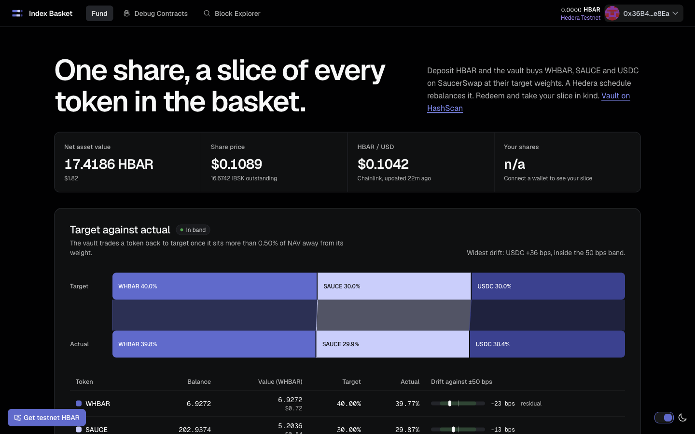

# Index Basket

The Hedera-native, single-chain answer to Hedera's featured cross-chain ETF template: a vault that books its own rebalances with the Hedera Schedule Service (HIP-1215). Hedera's own words for what that enables: "Vaults schedule their own rebalancing operations at optimal intervals." ([Hedera blog](https://hedera.com/blog/real-world-applications-of-protocol-level-smart-contract-automation-on-hedera/))
It builds on other people's protocols: SaucerSwap V2 for every trade and price, Chainlink HBAR/USD for the dollar value, and HTS for the share token. A [Scaffold-HBAR](https://docs.hedera.com/solutions/tools/scaffold-hbar/index) template.

One HBAR deposit into `BasketVault` buys a 40% WHBAR / 30% SAUCE / 30% USDC basket on SaucerSwap V2 in a single transaction and mints an HTS share token (IBSK). Redeeming burns shares and pays out your slice of every token in kind. The Hedera network runs the rebalance schedule, so there is no keeper bot, server or hot key. The owner key starts, stops or rebalances by hand and nothing else. `rebalance()` accepts only the owner or the vault's own scheduled run, so an outsider cannot place a rebalance between their own trades (`test_regression_outsiderCannotProfitFromRebalance`).

**Live app:** [index-basket-hbar.vercel.app](https://index-basket-hbar.vercel.app) reads the canonical vault on Hedera testnet: NAV, target against actual weights, automation runway and the activity feed. Connect a wallet to deposit or redeem.

**Demo video:** [docs/demo/index-basket-demo.mp4](docs/demo/index-basket-demo.mp4), 2 min 42 s: the live app, a deposit, a network-triggered rebalance on HashScan, the protections and the one-command scaffold.



**10 rebalance runs executed by the Hedera network on the vault's own schedule, 4 of them traded, 0 triggered by a person.** Read from the mirror node on 2026-10-04 14:48 UTC (block 41350655) for vault C `0xe72FbF68536D29d3A9e0D897C2aE813B7B279058` (contract 0.0.10839904). Every one is a `CONTRACTCALL` with `scheduled: true`. Recount it:

```bash
V=0xe72FbF68536D29d3A9e0D897C2aE813B7B279058; H=https://testnet.mirrornode.hedera.com; M=$H/api/v1
T=$(cast keccak "ScheduledRun(bool)"); u="$M/contracts/$V/results/logs?order=asc&limit=100"
while [ -n "$u" ]; do
  p=$(curl -s "$u"); echo "$p" | jq -r --arg t "$T" '.logs[]|select(.topics[0]==$t)|"\(.timestamp) \(.data[-1:])"'
  n=$(echo "$p" | jq -r '.links.next // empty'); u=${n:+$H$n}
done | while read ts f; do
  echo "$ts traded=$f scheduled=$(curl -s "$M/transactions?timestamp=$ts" | jq -r '.transactions[0].scheduled')"
done
```

## See it work in five minutes

1. Run the app against the live vault, no key needed:

   ```bash
   npm create scaffold-hbar@latest -- --template kamalbuilds/scaffold-hbar-index-basket
   cd <your-project>
   yarn install
   yarn next:dev
   ```

   The `--` matters with `npm create`: without it npm keeps `--template` for itself. Open `localhost:3000`. The fund page reads vault C on Hedera testnet.
2. Run the contract tests, no network needed: `yarn foundry:test`.
3. Deploy your own vault. Put a funded ECDSA testnet key in `packages/foundry/.env` as `DEPLOYER_PRIVATE_KEY`, then run `yarn foundry:live`. It deploys a vault and runs every flow on testnet.
4. Restart `yarn next:dev`. The app now shows your vault.

Prerequisites, environment variables and the Foundry 1.7.1 pin are in [Quickstart](docs/details.md#quickstart).

**Proof on HashScan:**

- HTS share token minted on deposit: https://hashscan.io/testnet/transaction/0xe993751cad6ac8774be9387eafa0e7fed1280a3d7790889314f3cb12a70b7b0c
- Hedera Schedule Service ran a rebalance with no human transaction (sold USDC back to target): https://hashscan.io/testnet/transaction/1791020419.010852853
- Same, buy side: https://hashscan.io/testnet/transaction/1791020800.024519104

## What you learn from this template

- Minting and burning an HTS token from a contract that is its treasury and supply key.
- A contract that books its own future calls with the Hedera Schedule Service (HIP-1215) and pays for them.
- HIP-719 token association from contracts and from the UI.
- Pricing a basket from SaucerSwap V2 pool state and Chainlink HBAR/USD.
- Reading contract events from the mirror node instead of `eth_getLogs`.

You get one Solidity contract with all the vault logic, 157 Foundry tests that need no network, a Next.js fund page, a script that runs every flow on testnet and prints a HashScan link per transaction, and [AGENTS.md](AGENTS.md) for coding agents.

## Documentation

- [docs/details.md](docs/details.md): the long form. [Why each protocol](docs/details.md#why-it-needs-saucerswap-chainlink-hts-and-hss), [how the pieces connect](docs/details.md#how-the-pieces-connect), [environment variables](docs/details.md#environment-variables), [how it works](docs/details.md#how-it-works), [proven on testnet](docs/details.md#proven-on-hedera-testnet), [costs](docs/details.md#costs), [customize](docs/details.md#customize), [deploy to mainnet](docs/details.md#deploy-to-mainnet), [testing](docs/details.md#testing), [the AI agent plugin](docs/details.md#operate-it-from-an-ai-agent), [the Harness recipe](docs/details.md#extend-it-with-hedera-harness) and [troubleshooting](docs/details.md#troubleshooting).
- [docs/architecture.md](docs/architecture.md): who can call what, the contract state, and the external calls each flow makes.
- [docs/hedera-gotchas.md](docs/hedera-gotchas.md): each Hedera behaviour the vault is built around, with the reproduce command and the source.
- [docs/testnet-evidence.md](docs/testnet-evidence.md): every testnet transaction with the command that re-checks its post-condition.
- [RUNBOOK.md](RUNBOOK.md): operate the deployed vault: top up fuel, start, stop and rearm automation, rotate the owner, enable the price guard, redeploy, and re-read the evidence with `scripts/verify-evidence.sh`.
- [agent/README.md](agent/README.md): the Hedera Agent Kit plugin and its testnet proof.
- [AGENTS.md](AGENTS.md): the briefing for coding agents: commands, units, invariants and common changes.
- [.harness/README.md](.harness/README.md): the Hedera Harness recipe for adding a third token leg, and the validators that judge it.

## License

MIT. See [LICENCE](LICENCE).
