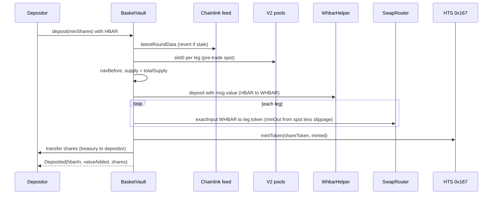
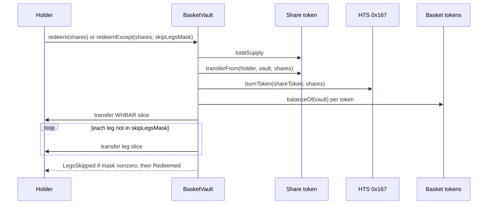
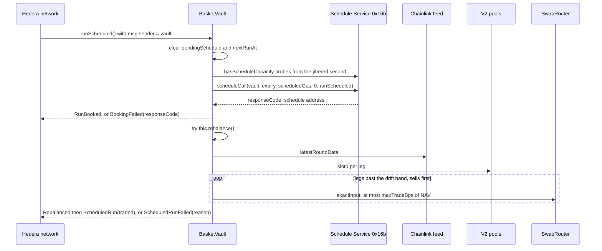

# Architecture

`BasketVault` is one contract. It takes HBAR, buys a weighted basket of HTS tokens on SaucerSwap V2, mints an HTS share token for the depositor's slice, pays redemptions out in kind, and books its own rebalances through the Hedera Schedule Service. Chainlink HBAR/USD prices the fund in USD. Everything below is read from `packages/foundry/contracts/BasketVault.sol`.

## Who can call what

| Caller | Functions |
| --- | --- |
| Anyone | `deposit`, `redeem`, `redeemExcept`, `rearm`, and every view |
| Owner | `initialize`, `startAutomation`, `stopAutomation`, `withdrawFuel`, `rebalance` |
| The vault itself (a network-run schedule) | `runScheduled`, which calls `rebalance` |

`rebalance` reverts `OnlyOwnerOrSelf` for everyone else. It sizes and bounds its swaps from pool spot prices, so an outside caller could move a pool earlier in the same transaction, let the vault trade against that price, and trade back. Scheduled runs and the owner are the only entries.

## Contract state

Fixed at deployment (immutables):

| Name | Meaning | Testnet deploy |
| --- | --- | --- |
| `router` | SaucerSwap V2 SwapRouter | `0x...159398` (0.0.1414040) |
| `factory` | SaucerSwap V2 factory every leg's pool is verified against | SaucerSwapV2Factory `0x...1243eE` (0.0.1197038) |
| `whbarHelper` | Wraps native HBAR into WHBAR | `0x...50a8a7` (0.0.5286055) |
| `whbar` | WHBAR token | `0x...3aD2` (0.0.15058) |
| `hbarUsdFeed` | Chainlink HBAR/USD, 8 decimals | `0x59bC155EB6c6C415fE43255aF66EcF0523c92B4a` |
| `maxOracleAge` | Oldest accepted Chainlink answer | 90,000 s (25 h) |
| `driftBps` | Distance from target before a leg is traded | `DRIFT_BPS` env, 50 (0.5%) on the canonical vault |
| `slippageBps` | Most a swap may return below the pre-trade spot price | 300 (3%) |
| `maxTradeBps` | Most one rebalance swap may move, in basis points of NAV per leg per call | `MAX_TRADE_BPS` env, default 2000 (20%) |
| `scheduledGas` | Gas each scheduled rebalance is booked with | 4,000,000 |
| `guardLeg`, `maxDeviationBps` | Stablecoin leg checked against Chainlink and the tolerance; `type(uint256).max` turns the guard off | off on testnet |
| `whbarWeightBps` | `10_000` minus the sum of leg weights | 4000 |

Storage:

| Name | Meaning |
| --- | --- |
| `_legs` (`legs()`) | Per leg: token, pool, pool fee, whether the token is the pool's token0, weight in bps |
| `shareToken` | The HTS share token. The vault is its treasury and holds its supply key |
| `rebalanceInterval` | Seconds between runs, `0` while automation is off |
| `pendingSchedule` | The schedule that will run next, or `address(0)` |
| `nextRunAt` | Consensus second the pending schedule is booked for |

Constants: `DEAD_SHARES = 1e5`, `MIN_INTERVAL = 60`, `MAX_INTERVAL = 60 days`, `MIN_SCHEDULED_GAS = 3_000_000`, share decimals 8, and the two Hedera system contracts at `0x167` (Token Service) and `0x16b` (Schedule Service).

The basket of the canonical deployment:

| Token | Weight | Pool |
| --- | --- | --- |
| WHBAR (0.0.15058) | 40% (the remainder) | held directly |
| SAUCE (0.0.1183558) | 30% | WHBAR/SAUCE 0.30%, `0x37814eDc1ae88cf27c0C346648721FB04e7E0AE7` |
| USDC (0.0.5449) | 30% | WHBAR/USDC 0.30%, `0x914B98992d7eD602D1f5d9084ECe8160Fc0e741a` |

Constructor checks (each reverts `BadConfig`): non-zero router, factory, helper, WHBAR and feed; at least one leg; slippage in `(0, 10000)`; drift in `(0, 10000)`; `maxTradeBps` in `(0, 10000]`; non-zero `maxOracleAge`; `scheduledGas >= 3_000_000`; an enabled guard needs an in-range `guardLeg` and a tolerance in `(0, 10000)`; the feed reports 8 decimals; no leg is WHBAR; no two legs share a token; each leg's pool equals `factory.getPool(token, WHBAR, pool.fee())`, is paired with WHBAR and holds the leg token; weights are non-zero and sum below 10,000. The factory check means the vault prices its holdings from the pool the router actually trades in, never from a contract a deployer controls.

## External calls per flow

### initialize (owner)

1. For WHBAR and each leg token: `IHRC719(token).associate()` (HIP-719). Response code 22 or 194 passes.
2. `HTS(0x167).createFungibleToken{value: msg.value}` with the vault as treasury, the vault as supply key holder, 8 decimals and no maximum supply.

### deposit (anyone)



An HTS `approve` of WHBAR to the router happens first when the allowance is short (`_swap`). The first deposit pays for it.

### redeem and redeemExcept (anyone, shares approved to the vault)



No oracle or pool is called. `redeem(shares)` is `redeemExcept(shares, 0)`. Bit `i` of the mask skips `legs()[i]`: that token is not paid, and the holder's slice of it stays in the vault for the remaining holders. A bit beyond the last leg reverts `BadSkipMask`. The WHBAR slice is always paid.

### scheduled run (the network)



The network pays from the vault's native HBAR. The run books its successor before it rebalances and wraps the rebalance in `try/catch`, so a failed rebalance costs one run and never the chain. A run books exactly once.

Booking second: `block.timestamp + rebalanceInterval + jitter`, where `jitter = keccak256(blockhash(block.number - 1), prevrandao) % 30`, so the seconds a run will ask for cannot be filled in advance. If that second is full, `_secondWithCapacity` tries +1, +2, +4, +8, +16, +32 and +64 seconds.

### startAutomation, stopAutomation, rearm

- `startAutomation(interval)` (owner): interval in `[60, 60 days]`, books the first run through `_bookNext`, reverts `ScheduleFailed(code)` if the network refuses.
- `stopAutomation()` (owner): zeroes the interval, `pendingSchedule` and `nextRunAt`, calls `HSS.deleteSchedule(pending)` and emits `ScheduleDeleted(schedule, responseCode)`. Codes 201, 212 and 213 (already ran, expired, deleted) do not revert.
- `rearm()` (anyone): if automation is on and no run is pending, which is what a refused booking inside a run leaves, books the next run. Reverts `NotAutomated` when the interval is 0 and `RunAlreadyPending` when a run is booked. A refused booking inside `runScheduled` keeps `rebalanceInterval`, so nobody can switch automation off by filling the probed seconds.

## Share math

NAV is the vault's WHBAR balance plus each leg's balance converted to WHBAR at the pool's spot price. A pool stores `sqrtPriceX96`, and the price of token1 in token0 raw units is `(sqrtPriceX96 / 2^96)^2`. `_legToWhbar` and `_whbarToLeg` apply it with `Math.mulDiv` in two steps, so no intermediate overflows and the token decimals (WHBAR 8, SAUCE and USDC 6) fall out of the raw units.

Deposit:

```
spend_i      = msg.value * weightBps_i / 10_000              WHBAR sent to leg i
minOut_i     = whbarToLeg(spend_i at spot) * (10_000 - slippageBps) / 10_000
valueAdded   = msg.value - sum(spend_i) + sum(legToWhbar(bought_i at the pre-trade spot))
minted       = valueAdded                                    when supply == 0
             = valueAdded * supply / navBefore               otherwise
shares       = minted - min(minted, DEAD_SHARES)             when supply == 0, else minted
```

`navBefore` and every price are read before the first swap, so the depositor's own price impact and the pool fees come out of `valueAdded`, not out of the holders already in. The first deposit mints `minted` to the vault and sends `minted - 100,000` to the depositor; the 100,000 stay in the treasury for good.

Redeem:

```
out_token = balanceOf(vault, token) * shares / supply        for WHBAR and every non-skipped leg
```

### Worked example: the first deposit of vault B

An earlier deployment of the same design. Transaction [0x166dbd...](https://hashscan.io/testnet/transaction/0x166dbdf605c53460968ffec8becd0ee5ed30eeb0e395bfb3b2b1708ed5beb102), 20 HBAR, supply 0.

| Step | Value |
| --- | --- |
| `msg.value` | 2,000,000,000 tinybar (20 HBAR), wrapped to WHBAR |
| `spend` SAUCE (30%) | 600,000,000 |
| `spend` USDC (30%) | 600,000,000 |
| WHBAR kept (40%) | 2,000,000,000 - 600,000,000 - 600,000,000 = 800,000,000 |
| SAUCE bought | 239,400,499 raw (239.400499 SAUCE) |
| USDC bought | 11,379,780 raw (11.37978 USDC) |
| `valueAdded` (pre-trade spot) | 1,995,783,597 |
| `minted` (supply is 0) | 1,995,783,597 |
| Locked as `DEAD_SHARES` | 100,000 |
| Shares to the depositor | 1,995,783,597 - 100,000 = 1,995,683,597 = 19.95683597 IBSK |

The two bought legs are valued at 1,195,783,597 for the 1,200,000,000 spent: a 0.351% cost, the 0.30% pool fee plus price impact, paid by the depositor in shares (19.9568 for 20 HBAR). The share ledger balances to the unit on chain: the owner (997,841,799), the UI wallet (299,048,386) and the vault's locked shares (100,000) sum to the 1,296,990,185 total supply. Commands for both are in [testnet-evidence.md](testnet-evidence.md#2-deposits).

The matching redeem, [0x4c3313...](https://hashscan.io/testnet/transaction/0x4c33133b1fb8caf8d9e3f8b28a68543f1edef4551dd8bc83b9a51af1e5534328): shares 997,841,798 of supply 1,995,783,597.

| Token | Vault balance | `balance * shares / supply` | Paid |
| --- | --- | --- | --- |
| WHBAR | 800,000,000 | 399,979,957 | 399,979,957 |
| SAUCE | 239,400,499 | 119,694,251 | 119,694,251 |
| USDC | 11,379,780 | 5,689,604 | 5,689,604 |

### Rebalance sizing

For a leg with value `v`, target `t = NAV * weightBps / 10_000` and band `b = NAV * driftBps / 10_000`:

- sell when `v > t + b`: `excess = min(v - t, maxTrade)`, `amountIn = balance * excess / v`, `minOut = excess * (1 - slippage)`;
- buy when `v + b < t`: `spend = min(t - v, maxTrade, WHBAR balance)`;
- `maxTrade = NAV * maxTradeBps / 10_000`.

Sells run first so the buys have WHBAR to spend. A leg further out than `maxTrade` converges over several runs instead of reverting on a trade the pool cannot fill. Vault C run 1 had NAV 10.08934544 HBAR and USDC 0.70 points over target (an excess of about 7.1 million tinybar) and sold 0.129039 USDC; a 20% cap on that NAV is 201,786,908 tinybar, so the cap leaves a correction of that size untouched.

## Invariants and the tests that enforce them

Each row lists tests in `packages/foundry/test/`. `yarn foundry:test` runs all of them without a network.

| # | Invariant | Tests |
| --- | --- | --- |
| 1 | Redeem never reads a price. A stale oracle or a broken pool never traps a holder | `test_redeem_worksWithStaleOracleWhereDepositReverts`, `test_redeem_worksWhenTheGuardPoolIsBroken`, `test_redeemExcept_stillReadsNoPrice` |
| 2 | Deposits are valued at pre-trade spot prices; the depositor bears their own impact and fees | `test_secondDeposit_priceImpactAndFeesAreBorneByTheDepositor`, `test_secondDeposit_getsSharesProportionalToValueAddedAndDoesNotDiluteTheFirstHolder` |
| 3 | The first deposit locks `DEAD_SHARES` in the treasury | `test_firstDeposit_locksDeadSharesAndMintsTheRestToTheDepositor`, `test_deposit_dustThatWouldAllBecomeDeadSharesReverts`, `test_redeem_everyoneOutLeavesOnlyDustForTheDeadShares`, `test_deposit_isNotBlockedByAnotherHoldersDonationToTheVault` |
| 4 | `runScheduled` never reverts and books its successor before rebalancing | `test_scheduledRun_booksTheSuccessorBeforeItRebalances`, `test_scheduledRun_neverRevertsWhenTheRebalanceDoes_andStillBooksTheNextRun`, `test_scheduledRun_reportsWhyTheRebalanceFailed`, `test_scheduledRun_emitsBookingFailedAndStillRebalancesWhenTheSuccessorCannotBeBooked` |
| 5 | One `scheduleCall` per scheduled execution | `test_scheduledRun_booksTheSuccessorBeforeItRebalances` (asserts exactly one `RunBooked`), `test_scheduledRun_chainsAcrossSeveralRuns` |
| 6 | Native HBAR in the vault is fuel, never basket value | `test_withdrawFuel_movesNativeHbarAndNeverBasketTokens`, `test_deposit_wrapsTheHbarAndKeepsNoneNative` |
| 7 | Only the owner or the vault itself may rebalance | `test_rebalance_isOwnerOrSelfOnly`, `test_rebalance_ownerMayCallItDirectly` |
| 8 | Only the vault's own schedule reaches `runScheduled` | `test_runScheduled_revertsForEveryoneButTheVault`, `test_runScheduled_runsWhenTheVaultCallsItself` |
| 9 | A holder can exit through the working legs when one leg is frozen | `test_frozenLeg_blocksPlainRedeemForEveryone`, `test_redeemExcept_paysTheOtherLegsWhenOneIsFrozen`, `test_redeemExcept_theSkippedSliceGoesToTheRemainingHolders`, `test_redeemExcept_worksWhenTheRedeemersOwnAccountIsFrozenForOneLeg`, `test_redeemExcept_zeroMaskIsExactlyRedeem`, `test_redeemExcept_everyLegSkippedPaysOnlyWhbar`, `test_redeemExcept_rejectsBitsBeyondTheLegs`, `test_redeemExcept_cannotTakeMoreThanTheShareOfNav` |
| 10 | A refused booking keeps automation on, and anyone can rearm | `test_lostBooking_keepsTheIntervalSoAnyoneCanRearm`, `test_rearm_isPermissionlessAndPaidFromTheVault`, `test_rearm_revertsWhileARunIsPending`, `test_rearm_revertsWhenAutomationIsOff`, `test_rearm_revertsWithTheCodeWhenTheBookingIsRefusedAgain` |
| 11 | Booking seconds are jittered and probe past busy seconds | `test_booking_jitterStaysInsideThirtySecondsAndFollowsChainRandomness`, `test_capacity_usesTheIdealSecondWhenFree`, `test_capacity_picksIdealPlusDelayWhenIdealIsBusy`, `test_capacity_backsOffExponentially`, `test_capacity_reachesTheLongestProbe`, `test_capacity_failsWithBusyCodeWhenEverySlotIsTaken` |
| 12 | Each rebalance swap is capped at `maxTradeBps` of NAV and large drifts converge | `test_cap_limitsEachSwapToAShareOfNav`, `test_cap_repeatedCallsConvergeIntoTheBand`, `test_cap_aFullSizedCapChangesNothing` |
| 13 | Every leg's pool is the factory's pool for its pair and fee, and legs are unique | `test_constructor_rejectsAPoolTheFactoryDoesNotKnow`, `test_constructor_rejectsAPoolRegisteredUnderAnotherFee`, `test_constructor_rejectsDuplicateLegTokens`, `test_constructor_rejectsWhbarAsALegToken`, `test_constructor_rejectsAZeroFactory`, `test_constructor_storesTheFactoryAndTradeCap` |
| 14 | A booked run always has at least 3M gas | `test_constructor_rejectsScheduledGasBelowThreeMillion` |
| 15 | Intervals stay inside the 62 day network limit | `test_start_rejectsIntervalsBelowTheMinimum`, `test_start_rejectsIntervalsAboveSixtyDays` |
| 16 | Stopping deletes the pending schedule and tolerates one that already ran | `test_stop_deletesThePendingScheduleAndClearsState`, `test_stop_emitsTheDeleteResponseCode`, `test_stop_doesNotRevertWhenTheScheduleAlreadyRanOrExpired` |
| 17 | A swap below the slippage floor reverts instead of settling | `test_deposit_revertsWhenSwapFallsBelowSlippage`, `test_rebalance_revertsWhenTheFillIsWorseThanSlippageAllows` |
| 18 | The pool-versus-Chainlink guard trips on a manipulated pool and stays off when unset | `test_guard_depositRevertsWhenThePoolIsFarBelowTheOracle`, `test_guard_depositRevertsWhenThePoolIsFarAboveTheOracle`, `test_guard_rebalanceIsGuardedToo`, `test_guard_isOffWhenNoGuardLegIsSet` |
| 19 | A deposit then a redeem never pays out more than went in | `testFuzz_depositRedeemRoundTripNeverPaysMore` |
| 20 | Approvals are made once and sized to the token supply | `test_deposit_onlyApprovesWhenAllowanceIsShort`, `test_rebalance_approvesTheSoldLegOnceForItsSupply` |

## Units

- HBAR in the EVM is tinybar (8 decimals): `msg.value`, `address(this).balance`, `tx.gasprice`. JSON-RPC wallets send weibar (18 decimals); 1 tinybar is `1e10` weibar.
- WHBAR and the share token have 8 decimals, SAUCE and USDC 6. `nav()` is WHBAR tinybar. `navUsd()`, `sharePriceUsd()` and `hbarUsd()` are USD with 8 decimals.
- HTS amounts are `int64`; the vault converts with `SafeCast`.
